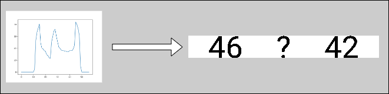

# 【小猿口算】如何用最简单的图像识别攻克实现自动比大小？

你将使用：adb，python
你将学会：如何在python中使用adb；如何用opencv实现最简单的数字识别；如何实现自动化刷题脚本

## (0).预备工作

为了更方便的测试和规避潜在的财产风险，推荐使用模拟器代替真机，常见的Android模拟器通常自带adb，请试试找到它。
（可选：为了让python方便地执行adb命令，可以将adb添加入环境变量）
你需要下载并准备python开发环境，并安装第三方库：opencv-python,numpy

```cmd
pip install opencv-python numpy
```

## (1).如何获取图像？

答案是adb的截图功能

```python
process = subprocess.Popen(
            ['adb', 'shell', 'screencap', '-p'],
            stdout=subprocess.PIPE
        )
output = process.communicate()[0].replace(b'\r\n', b'\n')
```

## (2).如何识别数字？

上一段我们得到整个页面的截图，现在要找到截图中题目的位置，这一步需要手动指定，因为位置是固定的，我们可以直接切出题目图像，将题目图像二值化，我们得到了完全由黑白两色组成的图像，其中黑色是数字

```python
img = cv2.imdecode(np.frombuffer(output, dtype=np.uint8), cv2.IMREAD_COLOR)
qes = cv2.cvtColor(img[rect[2]:rect[3], rect[0]:rect[1]], cv2.COLOR_BGR2GRAY)
ret, qes = cv2.threshold(qes, 170, 255, cv2.THRESH_BINARY)
```


如何提取出每一个数字？
首先提取数字所在的行，对题目图像每一行的黑色像素计数，显然那一段连续的非零值就是数字所在行，我们将这些行截取出来



然后同样的对每一列计数，那些连续非零段就是每单个数字所在的列，之间的零值就是数字间的空隙，再将每一段都切分处理，我们获得了每一个数字

|||||||||||
|--|--|--|--|--|--|--|--|--|--|

那么问题就变成了，如何识别这单个数字？
一个很有用的信息是，所有的数字都应该是一模一样的，数字7永远只有这一个样子，紧贴它的边缘裁下一个长方形，无论如何放缩都是极其相似的。
不用什么人工智能，甚至称不上算法，直接比较就行了！
计算带预测图片和每一个数字图片的MSE均方误差取MSE最小值，就是我们的答案。

$$
MSE = \frac{1}{n} \sum_{i=1}^{n} \sum_{j=1}^{m}(I_{i,j} - \hat {I}_{i,j})
$$

现在你可能有一个问题，那个原始的数字图像哪里来的？
事实上你可以先自行运行一次上述截图程序，并保存最后分割出来的单个数字图像作为原始图像。

## (3).如何计算答案？

在上一步，我们获得了单个数字，现在我们知道这题目由那几个数字组成，但是哪些数字在左边，哪些在右边？这也很简单，读者想一想就可以猜到，在剪裁单个数字的时候，我们获得了它的横向位置，让在中线左边的是左数字，右边的是右数字

## (4).如何输入答案？

调用adb执行拖动指令: adb shell input swipe {x1} {y1} {x2} {y2} {time}

## (5).如何实现全自动？

1、在完成一道题目后，系统回切换到下一题，作者目前没有想到如何获取系统的切换信号，脚本在做题阶段是在不间断截图的
在获取题面后，和“上一道题目”进行比较，如果一模一样，说明系统还没有完成切换，这时要跳过作答，在这时候答题会导致系统持续等待输入和读取失败

2、在完成连续的N道题目后，系统会连续跳出三个继续按钮，这些位置都是固定的，可以预先输入，再调用adb模拟点击

```python
cmd = f'adb shell input tap {self.next[0][1]} {self.next[0][0]}'
os.system(cmd)
cmd = f'adb shell input tap {self.next[1][1]} {self.next[1][0]}'
os.system(cmd)
cmd = f'adb shell input tap {self.next[2][1]} {self.next[2][0]}'
os.system(cmd)
```
